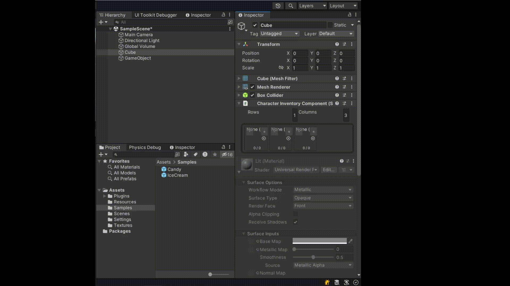

# Unity Inventory

## Описание

Данный репозиторий содержит Unity-ассет, представляющий инвентарь для использования в ваших проектах. Инвентарь создан с использованием современных практик разработки игр и предоставляет удобный и гибкий интерфейс для управления предметами в игре.

## Особенности

- Добавление, удаление и перемещение предметов в инвентаре.
- Графически интерактивный пользовательский интерфейс.
- Поддержка категорий и сортировка предметов.
- Легкость интеграции в ваши Unity-проекты.

## Пример использования

Используйте на вашем персонаже компонент CharacterInventoryComponent. Его публичное свойство InventoryService типа InventoryService содержит все необходимые методы для манипуляций с интевентарем.
Все объект которые должны помещаться в инвентарь должны быть унаследованы от BaseItem;
